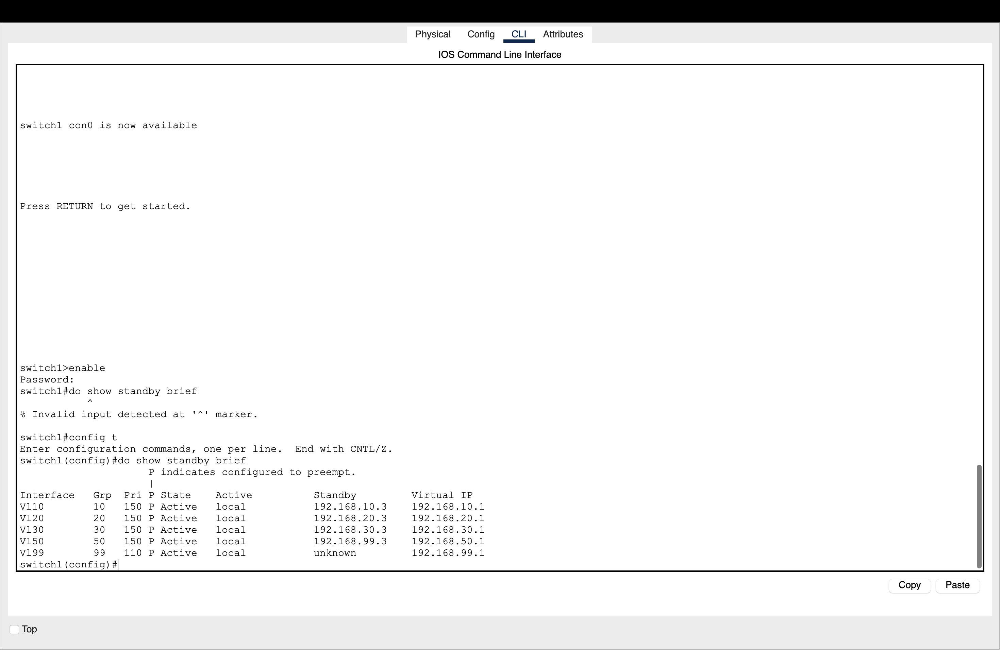

# 🏆 Secure and Redundant LAN Architecture
 HEAD
### Aura Digital Infrastructure Project | [🔗 View Project Dashboard on Notion](https://notion.so)

## 📖 Project Overview
This project represents a fully implemented, verified, and documented **Enterprise-Grade LAN**. The objective was to transition from a vulnerable "flat" network to a resilient, hierarchical environment utilizing the **STRIDE** threat model and **Hierarchical Layer 2/3** design principles.

### Aura Digital Infrastructure Project | [🔗 View Project Dashboard on Notion](https://www.notion.so)


 a808a00 (docs: final overhaul of README with MitM security layers)

## 📖 Project Overview
This project represents a fully implemented, verified, and documented **Enterprise-Grade LAN**. The objective was to transition from a vulnerable "flat" network to a resilient, hierarchical environment utilizing the **STRIDE** threat model and **Hierarchical Layer 2/3** design principles.

## 🛠️ Technical Toolkit
* **Core Networking:** HSRP (Gateway Redundancy), Inter-VLAN Routing (SVI), VLAN Segmentation.
* **Security & Hardening:** Extended ACLs (Zero-Trust Firewall), Port Security (Sticky MACs), **DHCP Snooping & DAI (MitM Protection)**, BPDU Guard.
* **Infrastructure Services:** NTP (Time Sync), SNMPv2c (Monitoring), SSH v2 (Encrypted Management).
* **Tools:** Cisco Packet Tracer, VS Code, Git/GitHub, Notion.


## 📐 System Architecture
 HEAD
The network is segmented into five functional VLANs to ensure strict traffic isolation and broadcast domain management:

The network is segmented into functional VLANs to ensure strict traffic isolation and broadcast domain management:
 a808a00 (docs: final overhaul of README with MitM security layers)

| VLAN | Name | Subnet | Role |
| :--- | :--- | :--- | :--- |
| **10** | IT_Admin | 192.168.10.0/24 | Privileged administrative access |
| **20** | Sales | 192.168.20.0/24 | General staff operations |
| **30** | Guest | 192.168.30.0/24 | Restricted internet-only access |
| **50** | Servers | 192.168.50.0/24 | Critical internal resources |
| **99** | Management | 192.168.99.0/24 | Infrastructure management (SSH/SNMP) |


HEAD
## 🛡️ Security & Redundancy Highlights

## 🛡️ Security & Redundant Highlights
 a808a00 (docs: final overhaul of README with MitM security layers)

### 1. High Availability (HSRP)
To eliminate single points of failure, **Hot Standby Router Protocol** was deployed across the Core Layer.
* **Active:** CORE-SW A (Priority 150)
* **Standby:** CORE-SW B (Priority 100)
 HEAD
* **Result:** The Virtual Gateway IP (`.1`) provides seamless failover in < 3 seconds.

* **Result:** Virtual Gateway IP (`.1`) provides seamless failover in < 3 seconds.
 a808a00 (docs: final overhaul of README with MitM security layers)

### 2. Inter-Subnet Firewall (ACL 199)
A **Zero Trust** approach was applied to the routing boundary. Extended ACLs prevent the **Guest** and **IT** subnets from accessing the **Management** plane, mitigating internal lateral movement.

 HEAD
### 3. Access Layer Hardening

### 3. Man-in-the-Middle (MitM) Mitigation
* **DHCP Snooping:** Configured with a trusted boundary on the Gigabit uplink to prevent rogue DHCP server attacks.
* **Dynamic ARP Inspection (DAI):** Validates ARP packets against the DHCP binding database to eliminate ARP poisoning and spoofing.

### 4. Access Layer Hardening
 a808a00 (docs: final overhaul of README with MitM security layers)
* **Port Security:** Limited to 2 MAC addresses per port (PC + IP Phone) using `sticky` learning and `shutdown` violation mode.
* **BPDU Guard:** Globally enabled on all PortFast access ports to automatically disable interfaces if a rogue switch is detected.


## 📝 Engineering Remediation Log
During the implementation phase, the following critical issues were identified and resolved:

| Phase | Issue Identified | Resolution |
| :--- | :--- | :--- |
HEAD
| **L3 Routing** | SVI subnet mask set to /32 | Reconfigured all SVIs to standard /24 mask. |
| **Redundancy** | HSRP Missing on Core | Configured HSRP groups with priority 150 on Primary Core. |
| **Security** | ACL defined but not applied | Applied `ip access-group 199 in` to SVIs on both Core switches. |
| **L2 Hardening** | BPDU Guard Disabled | Globally activated BPDU Guard default on ACCESS-SW 3. |

| **L3 Routing** | SVI subnet mask set to /32 | Reconfigured all SVIs to standard /24 mask to enable routing. |
| **Redundancy** | HSRP Missing on Core | Configured HSRP groups with priority 150 on Primary Core for failover. |
| **Security** | ACL defined but not applied | Applied `ip access-group 199 in` to SVIs on both Core switches. |
| **L2 Security** | Susceptibility to ARP Poisoning | Implemented DHCP Snooping and DAI with trusted boundary on Gig0/1. |
| **Hardening** | BPDU Guard Disabled | Globally activated BPDU Guard default on Access Layer switches. |
 a808a00 (docs: final overhaul of README with MitM security layers)


## ⚙️ Maintenance Runbook: Port Security Recovery
In the event of a security violation leading to an `err-disabled` state:
HEAD

1. **Identify:** Check status using `show interface status err-disabled`.
2. **Mitigate:** Physically remove the unauthorized device.
3. **Restore:**
```bash
conf t
interface [Interface_ID]
shutdown
no shutdown
Status: 🟢 VERIFIED & COMPLETE Last Update: April 2026

Contributor: chifru19 (Frank Fru)


1. **Identify:** Check status using `show interface status err-disabled`.
2. **Mitigate:** Physically remove the unauthorized device/switch.
3. **Restore:**
```bash
conf t
interface [Interface_ID]
shutdown
no shutdown
Status: 🟢 VERIFIED & COMPLETE Last Update: April 2026

Contributor: chifru19 (Frank Fru)
 a808a00 (docs: final overhaul of README with MitM security layers)
## ✅ Final Security Verification
| Feature | CLI Command | Success Criteria |
| :--- | :--- | :--- |
| **Redundancy** | `do show standby brief` | All VLANs show 'Active' on Sw1 |
| **Port Security** | `do show port-security` | All edge ports show 'Secure-up' |
| **DHCP Integrity** | `do show ip dhcp snooping` | VLANs 10, 20, 30, 50, 99 active |
| **SSH Security** | `do show ip ssh` | Version 2.0 confirmed |
## 🛡️ Project Aura Security Specification
* **HSRP Redundancy:** Confirmed Active/Standby for all production VLANs.
* **Port Security:** Sticky MAC address enforcement on access ports.
* **DHCP Snooping:** Rogue server mitigation globally enabled for VLANs 10, 20, 30, 50, 99.
* **Management:** Encrypted SSH v2 sessions with VTY Access-Lists.

## 🛡️ Security Implementation Details
- **HSRP Redundancy**: Active/Standby failover for gateway resilience.
- **Port Security**: Sticky MAC learning prevents unauthorized hardware access.
- **DHCP Snooping**: Trusted/Untrusted boundary protection against rogue DHCP servers.
- **SSH v2**: Encrypted management sessions restricted by VTY Access-Lists.

## 🚀 Final Infrastructure Specs
* **High Availability:** HSRP active on all VLANs with priority-based preemption.
* **Edge Defense:** Port-security with Sticky MAC learning (Layer 2).
* **IP Protection:** DHCP Snooping enabled across the core to prevent MITM attacks.
* **Secure Access:** SSH v2 encryption with VTY access-lists for admin subnets.

